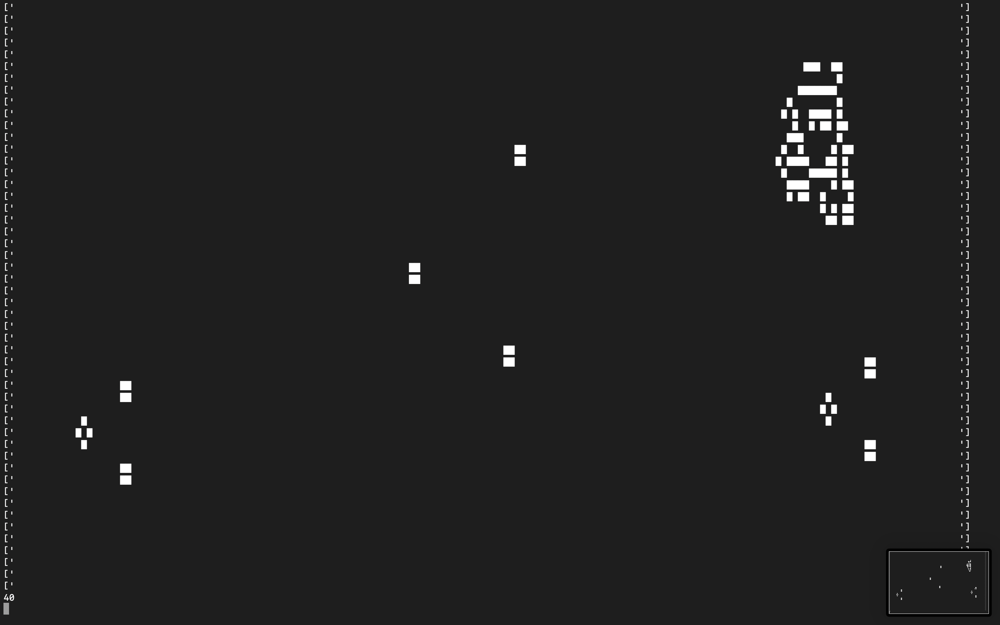
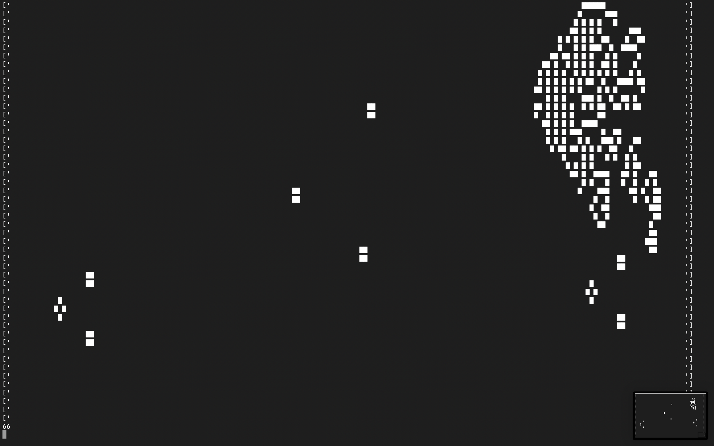
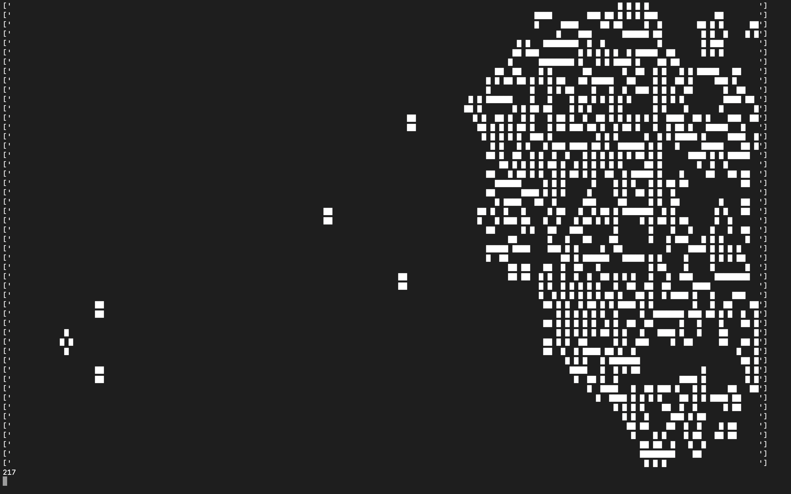

# Game of Life

Command Line Conway's Game of Life
Custom population can be set by the set_population() method with a numpy array or 
a random population density can be changed from 'high' to 'low' in the main.py file.

Dependencies: 
  - python3
  - numpy

Usage:
```
git clone https://github.com/kubakos/game-of-life.git
cd game-of-life
./main.py
```




